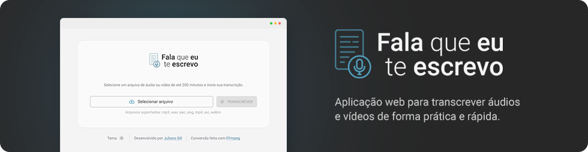

# Fala que eu te escrevo

Aplicação web para transcrição de áudios e vídeos com Azure Speech AI.

Desenvolvida em Next.js 14, utilizando Material UI e FFmpeg para conversão de áudio e vídeo para formato `.wav` (*requisito da Azure Speech AI*).

## Tecnologias utilizadas


## Live preview

Acesse a aplicação [neste link](https://falaqueeuteescrevo.julianosill.com.br).

*Observação: este projeto está hospedado em serviço gratuito da Vercel. Portanto, a execução está limitada em 60 segundos. Caso a API demore e ultrapasse o tempo limite, a requisição será encerrada e retornará um erro 504.*

https://github.com/julianosill/falaqueeuteescuto/assets/8575672/50b41a79-3a30-4168-85c0-ff297d717bdc

## Instalação

Clone este repositório, acesse a pasta do projeto e instale as dependendências necessárias, com os comandos:

```bash
git clone https://github.com/julianosill/falaqueeuteescuto.git
cd falaqueeuteescuto
pnpm install
```

### Variáveis de ambiente

Crie um arquivo `.env.local` na pasta raíz do projeto ou renomeie o arquivo `.env.local_sample` e adicione as variáveis de ambiente conforme o exemplo abaixo:

```bash
# Microsoft Azure Speech AI
AZURE_SUBSCRIPTION_KEY=
AZURE_SERVICE_REGION=

# Metadata
## Duração máxima do arquivo de áudio ou vídeo (em minutos)
NEXT_PUBLIC_MAX_DURATION_IN_MIN=
## Tamanho máximo do arquivo enviado para conversão (em mb)
NEXT_PUBLIC_MAX_SIZE_IN_MB=

# URL pública da aplicação
NEXT_PUBLIC_APP_BASE_URL=
```

### Rodando localmente

Execute a aplicação com o comando:

```bash
pnpm dev
```

A aplicação estará disponível através do endereço informado em seu terminal, por exemplo: [http://localhost:3000](http://localhost:3000).

---

<sup>Desenvolvido por [Juliano Sill](https://github.com/julianosill)</sup>
